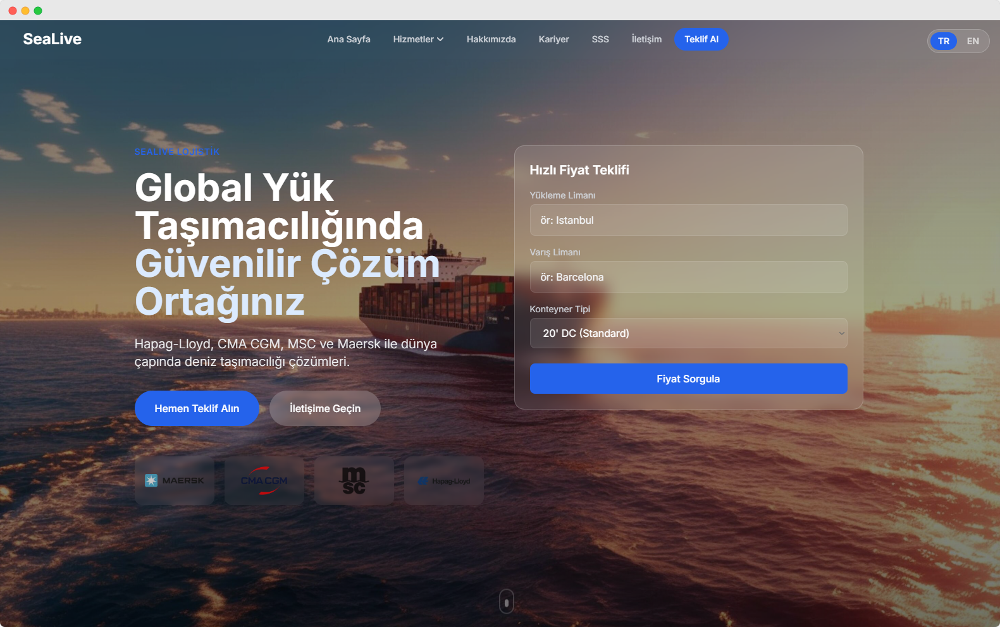
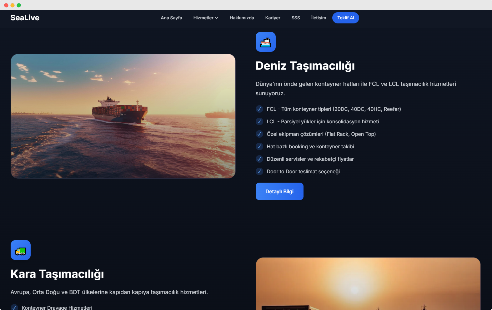
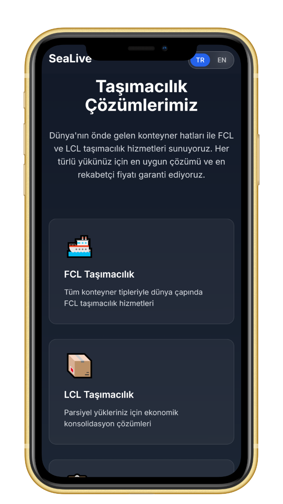
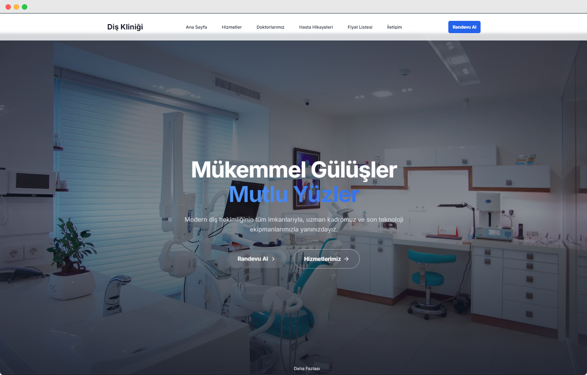
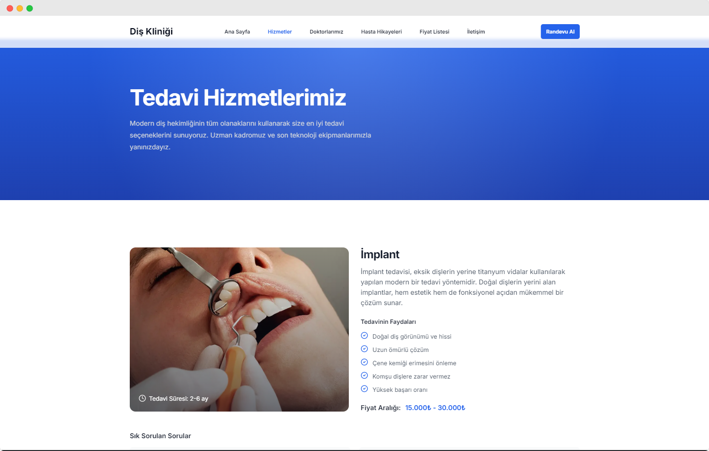
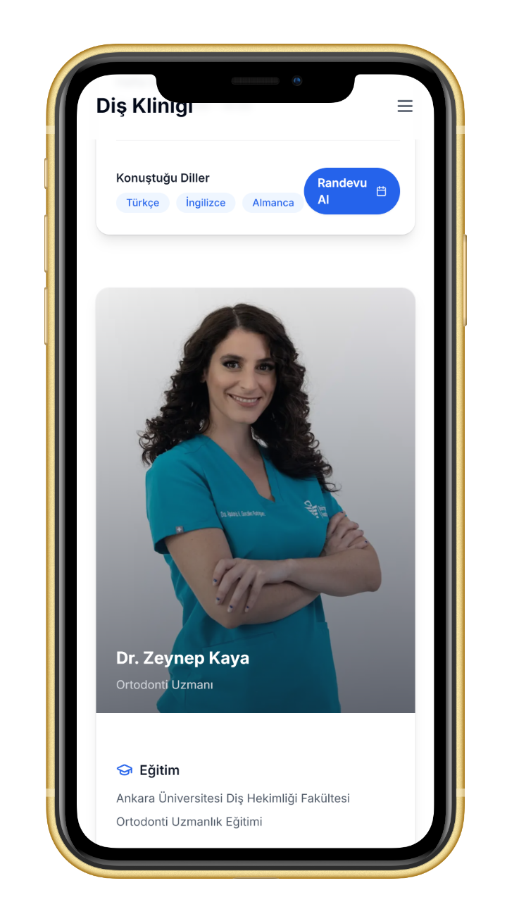
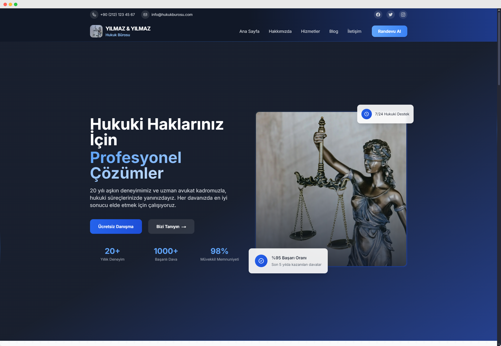
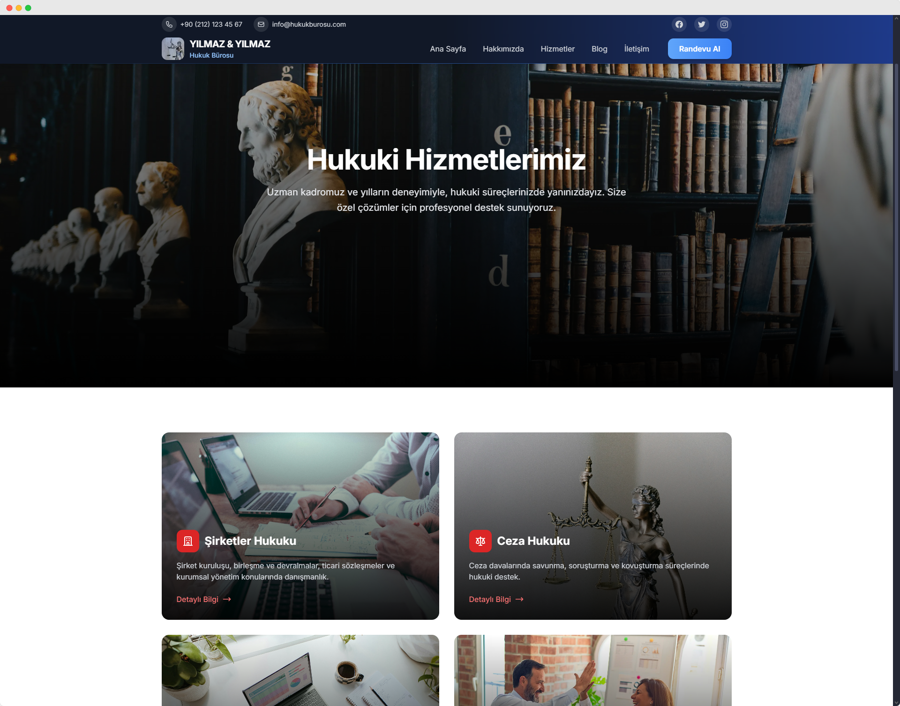
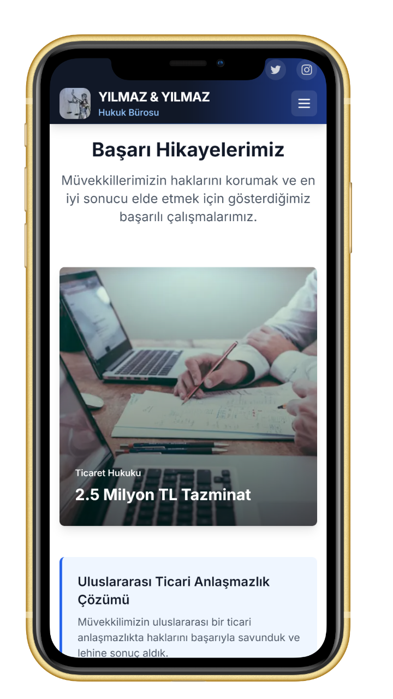

  
  
  

    
    
  

# 💫 Hakkımda

🚀 Full-Stack Web Developer  
💻 Next.js, React ve TypeScript uzmanı  
🌐 Responsive ve çok dilli web siteleri geliştiriyorum  
✨ Modern ve kullanıcı dostu arayüzler tasarlıyorum  
🔍 SEO odaklı web çözümleri sunuyorum

## 💻 Kullandığım teknolojiler

### Frontend Geliştirme

### Backend & Deployment

### Geliştirme Araçları

## 🎨 Projelerim

### 🚢 Lojistik Şirketi Web Sitesi

  

  <table>
    <tr>
      <td align="center">
        
         
        <i>Hizmetlerimiz</i>
      </td>
      <td align="center">
        
         
        <i>Mobil Görünüm</i>
      </td>
    </tr>
  </table>

**✨ Öne Çıkan Özellikler:**
- 🌍 Çok dilli destek (TR/EN)
- 💰 Dinamik fiyat hesaplama
- ✨ Etkileyici animasyonlar
- 🎨 Modern UI/UX tasarım
- 📊 Global ağ gösterimi
- 🚢 Konteyner takip sistemi
- 📱 Responsive tasarım
- 🔍 SEO optimizasyonu

  

    
    &nbsp;
    
  

### 🦷 Modern Diş Kliniği Web Sitesi

  

  <table>
    <tr>
      <td align="center">
        
         
        <i>Tedavi Hizmetleri</i>
      </td>
      <td align="center">
        
         
        <i>Mobil Görünüm</i>
      </td>
    </tr>
  </table>

**✨ Öne Çıkan Özellikler:**
- 🎨 Modern ve minimalist tasarım
- 📱 Tam responsive yapı
- 🔍 SEO optimizasyonu
- 📅 Online randevu sistemi
- ⚡ Yüksek performans skoru
- 🌐 Çoklu dil desteği (TR/EN)
- 🖼️ Animasyonlu kullanıcı arayüzü
- 📊 Detaylı hizmet sayfaları

  

    
    &nbsp;
    
  

### ⚖️ Hukuk Bürosu Web Sitesi

  

  <table>
    <tr>
      <td align="center">
        
         
        <i>Hizmet Alanları</i>
      </td>
      <td align="center">
        
         
        <i>Mobil Görünüm</i>
      </td>
    </tr>
  </table>

**✨ Öne Çıkan Özellikler:**
- 💼 Profesyonel kurumsal kimlik
- 📝 Dinamik blog sistemi
- 🌐 Kapsamlı hizmet alanları
- 📨 Gelişmiş iletişim formu
- 🎯 Hedef kitle odaklı tasarım
- ⚡ Yüksek performans
- 🖼️ Modern ve şık arayüz
- 📊 SEO optimizasyonu

  

    
    &nbsp;
    
  

## 🤝 İletişim

  

---

  

